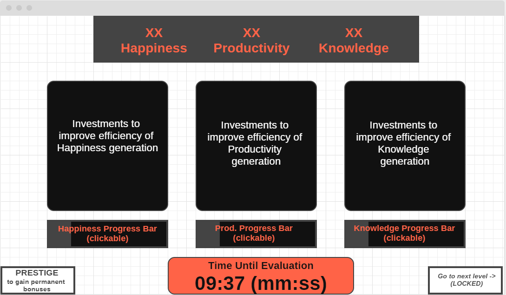
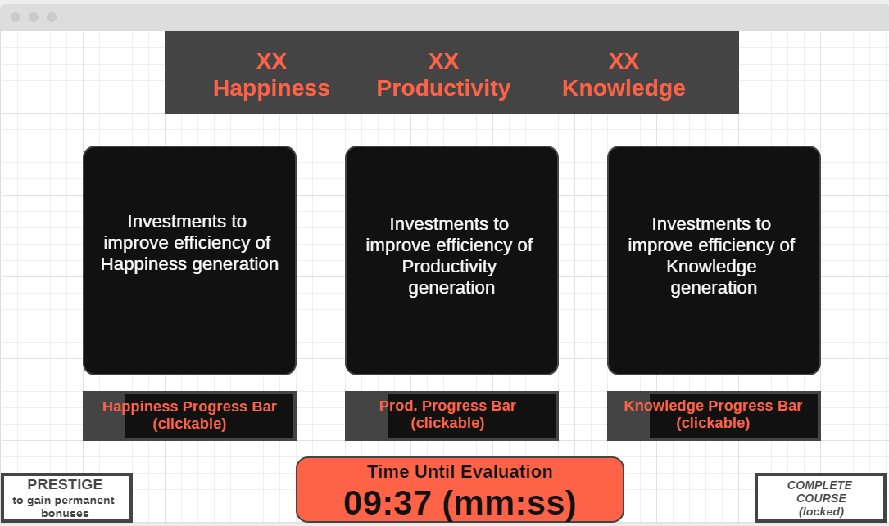

# Course Clicker

## Overview

Course Clicker will be a game of the incremental/clicker genre that is meant to be a satirical simulation of a student attempting to get through a college class with good grades. The main learning objectives of this project are to familiarize myself with React, and learn how to create interactive web applications.

The game will be broken down into two "levels", represented by two different web pages/routes on the site. The first level is from the start of the course to the midterm, and the second from then until the final exam. The 3 main resources the game will ask you to balance are *Happiness*, *Productivity*, and *Knowledge*. There will be different ways to generate each of these resources, but gaining a certain resource generally coming at the cost of one (or both) of the others. The core gameplay loop demands that you keep a balance between these resources, and invest your resources into accelerating the rate of your resource gains. 

Course Clicker is set apart from most other incremental games in that it has a concrete win condition - to gain enough Knowledge stat to obtain a passing grade on the midterm/final. In each level, you are racing against the clock to gain enough Knowledge before it's time to take the test. As with most incremental games, Course Clicker will feature a prestige mechanic, where you reset your progress in the current level in order to gain some permanent benefits. This will be necessary in order to get to a point where you can gain knowledge fast enough to pass your final evaluations.

## Data Model

The data model for this project is quite simple - a main "save file" document stores pertinent variables related to your progress in the game. Obviously I haven't ironed out all the details of the game's design, so the document below just names a portion of the stats that will eventually be in the game.

Depending on whether I end up implementing user auth (see below for my research topics), there will also be a user document, each of which can have one save file document (one to one relation).

An Example User:

```javascript
{
  username: "best_student_123",
  hash: // a password hash,
  saveFile: // an array of references to List documents
}
```

An Example Save File:

```javascript
{
  user: // a reference to a user document
  happiness: "10309",
  productivity: "2317",
  knowledge: "72",
  prestigeCount: "4",
  midtermPassed: "false", // condition for unlocking level 2
  happinessUpgrades: [
    { name: "upgrade1", level: "32", owned: true},
    { name: "upgrade2", level: "0", owned: false},
  ],
  prodUpgrades: [
    { name: "upgrade1", level: "5", owned: true},
    { name: "upgrade2", level: "1", owned: true},
  ],
  knowledgeUpgrades: [
    { name: "upgrade1", level: "0", owned: false},
    { name: "upgrade2", level: "0", owned: false},
  ],
  lastPlayed: // timestamp,
  createdAt: // timestamp
}
```

## [Link to Commented First Draft Schema](db.js) 

## Wireframes

/game - page for first level of the game (midterm)



/game2 - page for second level of the game (final)



Note that the routes for each level of the game are deliberately undescriptive to avoid spoiling the fact that a second level exists. You may notice that the general layout of both levels is essentially identical - the main difference will be the stat requirements, upgrade values and time restrictions present in each level, but the interface and core player interactions remain the same. This was done as a scoping decision, and for consistency of design.

To expand on what the wireframes suggest, the idea is that happiness is the easiest to accrue high quantities of, which you then spend to gain productivity at a slower rate, and likewise for productivity -> knowledge. The "exchange rates" and other variables for gaining these resources can be modified by investing in various upgrades, and the process can also be accelerated by clicking on a button below the stat's respective columns.

## Site map
 ________________
|                |
|       /        |
|                |  
|________________|
        |
        v
 ________________         ________________
|                |       |                |
|     /game      |  -->  |     /game2     |
|                |       |                |
|________________|       |________________| 

The `/` route will only exist if I end up integrating user auth in time. Otherwise, the site will start on the first level (`/game`), and once you meet the necessary conditions, a link will open up on `/game` to give you access to the second level (`/game2`).

## User Stories or Use Cases

1. as a user, I can interact with UI elements to invest my resources
2. as a user, I can open and close the game and have my save progress persist
3. as a user, I can passively gain resources while I do not have the game launched
4. as a user, I can reset progress in parts of my game to obtain permanent stat bonuses
5. as a user, I can pass the evaluation at the end of a level to obtain a level unlock/victory message
6. as a user, I can access the second level of the game only after meeting requirements within the first level

## Research Topics

* (6 points) React
    * Using React to construct the UI of my game.
    * Since it is quite a robust library with quite a bit to learn, I allocated 6 points for it.
* (2 points) Using CSS preprocessor Myth
    * Expanding the features available to me in my stylesheets seems useful for this type of project
    * Myth felt to me like a good balance between being featureful and straightforward to use
* (0-5 points) Passport.js for authentication
    * Since I'm uncertain how much time I will need to spend on learning React, I may or may not end up doing user log-in

8 points total out of 8 required points (13 out of 8 if I end up using passport)


## [Link to Initial Main Project File](app.js) 

## Annotations / References Used

1. [React website - learning resources + documentation](https://reactjs.org)
2. [65 minigames built in React](https://react.rocks/tag/Game)
3. [Myth CSS preprocessor GitHub/API](https://github.com/segmentio/myth)
